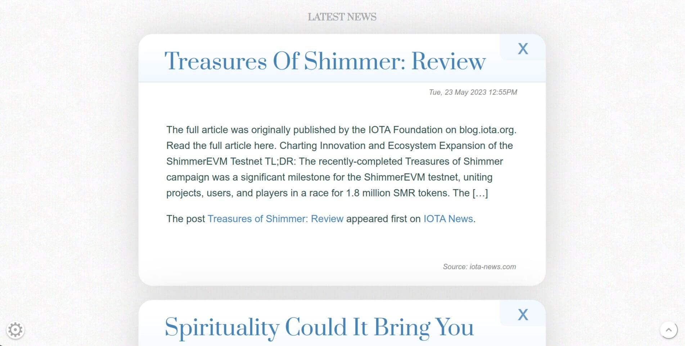

# not-the-news
Browser based single page scroll rss reader with keyword filtering.

Multiple rss feeds are aggregated into a single rss feed, rss items that flag up with filtered keywords are then removed.
On the website, closing an item will permanently remain closed. Hidden items are kept in localstorage

# dependencies

- Cron
- Python3
- PHP
- Nginx

Python3 modules:
- Feedparser
- Datetime
- json
- urlparse
- xml.etree.ElementTree
- hashlib


# configuration

add to crontab:

```*/30 * * * * su -c "python3 /home/<user>/not-the-news/run.py" <username>```

edit and rename the config examples in
www/config/
- feeds.txt
- filter_keywords.txt
- config.php

copy the nginx/sites-availble/news-nginx-example file to /etc/nginx/sites-available and edit the <yourdomain> sections of the file.

# running it
you can either wait for the cron to kick off the run.py
or you can exec the run.sh file manually
